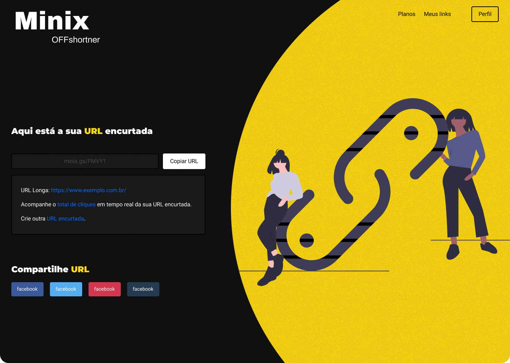

<h1 align="center">
    Minix OFFshrtnr
    
    <br>
</h1>

<h4 align="center">
  Rick & Morty api consumption website with Angular 2.
</h4>
<p align="center">
  

  

<!--   <a href="https://www.codacy.com/app/Nixoff/rick-morty?utm_source=github.com&amp;utm_medium=referral&amp;utm_content=nixoff/rick-morty&amp;utm_campaign=Badge_Grade">
    
  </a> -->

  
  <a href="https://github.com/Nixoff/rick-morty/commits/main">
    
  </a>

  <a href="https://github.com/Nixoff/rick-morty/issues">
    
  </a>

  
</p>

<p align="center">
  <a href="#rocket-technologies">Technologies</a>&nbsp;&nbsp;&nbsp;|&nbsp;&nbsp;&nbsp;
  <a href="#information_source-how-to-use">How To Use</a>&nbsp;&nbsp;&nbsp;|&nbsp;&nbsp;&nbsp;
  <a href="#memo-license">License</a>
</p>


<!--trocar esse gif -->
<p align="center">
  
</p>

## :rocket: Technologies

This project was developed for studies purposes only by [Gabriel M. Teixeira](https://github.com/nixoff) with the following technologies:

-  [Angular][angular]
-  [Figma][figma]
-  [VS Code][vc] with [EditorConfig][vceditconfig] and [ESLint][vceslint]

## :information_source: How To Use

To clone and run this application, you'll need [Git](https://git-scm.com), [Node.js v10.16][nodejs] or higher + [Yarn v1.13][yarn] or higher installed on your computer. From your command line:

```bash
# Clone this repository
$ git clone https://github.com/Nixoff/rick-morty.git

# Go into the repository
$ cd rick-morty

# Install dependencies
$ yarn install

# Run the app (Browser)
$ ng s --open

```

## :memo: License
This project is under the MIT license. See the [LICENSE](https://github.com/Nixoff/rick-morty/blob/master/LICENSE) for more information.

---

Made with ♥ by Gabriel M. Teixeira :wave: [Get in touch!](https://www.linkedin.com/in/gabriel-nix/)

[nodejs]: https://nodejs.org/
[yarn]: https://yarnpkg.com/
[vc]: https://code.visualstudio.com/
[vceditconfig]: https://marketplace.visualstudio.com/items?itemName=EditorConfig.EditorConfig
[vceslint]: https://marketplace.visualstudio.com/items?itemName=dbaeumer.vscode-eslint
[figma]: https://www.figma.com/
[angular]: https://angular.io/
