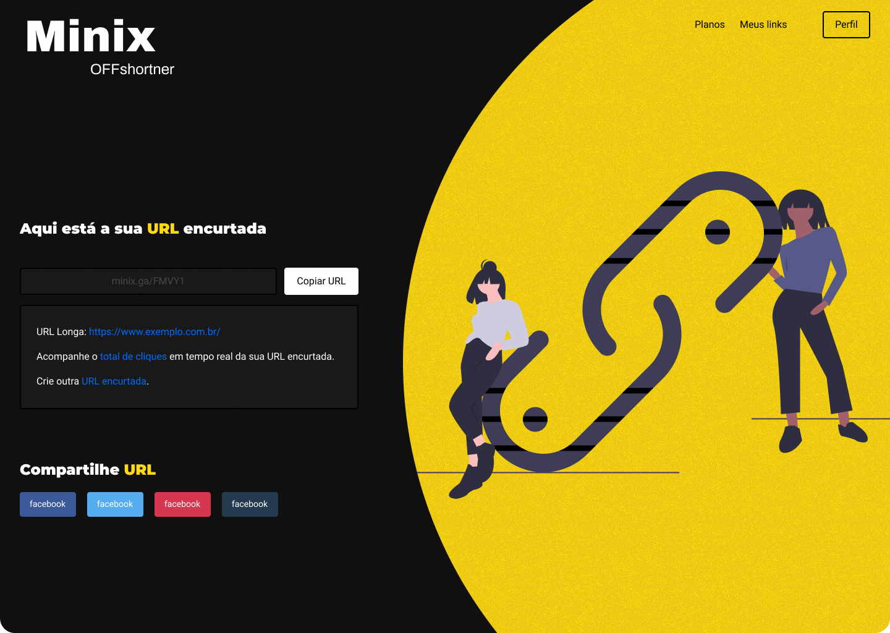
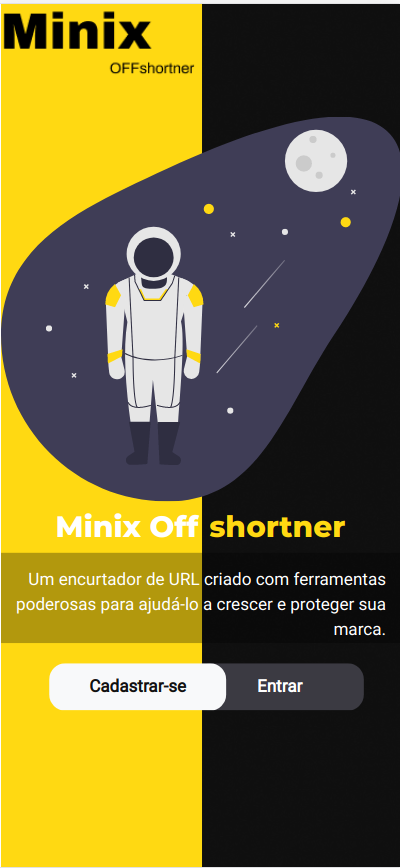
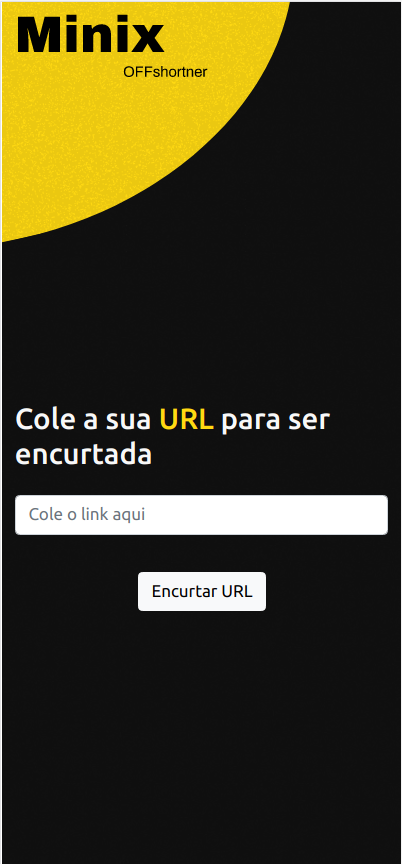
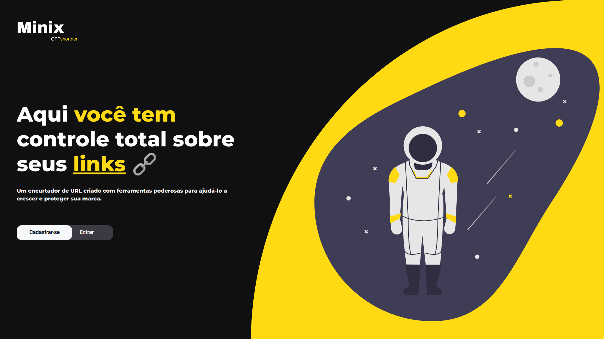
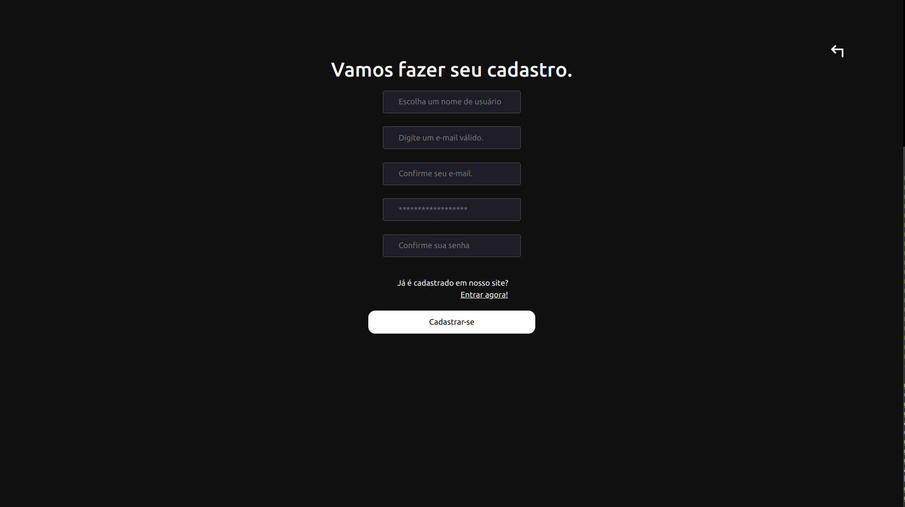

  

  

  
    
   
   

  
  
 

<h1 align="center">
    
</h1>

<h4 align="center"> 
	🚧  Minix ♻️ em andamento 🚀 🚧
</h4>

 <a href="#-sobre-o-projeto">Sobre</a> •
 <a href="#-funcionalidades">Funcionalidades</a> •
 <a href="#-layout">Layout</a> • 
 <a href="#-como-executar-o-projeto">Como executar</a> • 
 <a href="#-tecnologias">Tecnologias</a> • 
 <a href="#-autor">Autor</a> • 
 <a href="#user-content--licença">Licença</a>

## 💻 Sobre o projeto

♻️ MinixOFFShortner - é um encurtador de url pessoal e personalizado ao gosto do cliente.

Projeto desenvolvido durante  *Uma semana* como teste tecnico, oferecida pela [Mobi2Buy](https://mobi2buy.com/).
Fazer o teste foi uma experiência incrível. Me virando com muito conteúdo prático, desafios e "dores de cabeça" que me incentivaram ainda mais a resolver.

---

## ⚙️ Funcionalidades

- [x] Usuários podem se cadastrar na plataforma web enviando *nome completo*, *email*, *usuário* e *senha* e obter acesso as seguintes funcionalidades:
  - [x] Enviar uma url e encurta-la com código aleatorio ou personalizado.
  - [x] Salvar os links completos e encurtados

---

## 🎨 Layout
Comecei fazendo um protótipo inicial e depois finalizando de cabeça pois não tinha muito tempo.
O layout da aplicação está disponível no Figma:

### Mobile

  

  

### Web

  

  

---

## 🚀 Como executar o projeto

Este projeto é divido em duas partes separadas:
1. Backend (https://github.com/Nixoff/minixoff-backend) 
2. Frontend (esse repositorio)

💡Infelizmente não consegui integrar o backend da forma como gostaria então no momento não funcionam as requisições.

### Pré-requisitos

Antes de começar, você vai precisar ter instalado em sua máquina as seguintes ferramentas:
[Git](https://git-scm.com), [Node.js](https://nodejs.org/en/). 
Além disto é bom ter um editor para trabalhar com o código como [VSCode](https://code.visualstudio.com/)

#### 🎲 Rodando o Backend (servidor)

# Clone este repositório
$ git clone https://github.com/Nixoff/minixoff-backend.git

# Acesse a pasta do projeto no terminal/cmd
$ cd minixoff-backend/

# Instale as dependências
$ npm install

# Execute a aplicação 
$ npm start

# O servidor inciará na porta:3000 - acesse http://localhost:3000 

#### 🧭 Rodando a aplicação web (Frontend)

# Clone este repositório
$ git clone https://github.com/Nixoff/minixoff.git

# Acesse a pasta do projeto no seu terminal/cmd
$ cd minixoff

# Instale as dependências
$ npm install

# Execute a aplicação em modo de desenvolvimento
$ npm start

# A aplicação será aberta na porta:3000 - acesse http://localhost:3000

---

## 🛠 Tecnologias

As seguintes ferramentas foram usadas na construção do projeto:

#### *Website*  ([Angular](https://angular.io/cli/)  +  [TypeScript](https://www.typescriptlang.org/))

-   *[Bootstrap](https://getbootstrap.com/)*[Bootstrap](https://getbootstrap.com/)**
-   *[NGX-Bootstrap](https://valor-software.com/ngx-bootstrap/#/)*[NGX-Bootstrap](https://valor-software.com/ngx-bootstrap/#/)**

    Veja o arquivo  [package.json](https://github.com/Nixoff/minixoff/blob/main/package.json)

ja o arquivo  [package.json](https://github.com/Nixoff/minixoff/blob/main/package.json)

#### **Server**  ([NodeJS](https://nodejs.org/en/)  +  [TypeScript](https://www.typescriptlang.org/))

-   *[Express](https://expressjs.com/)*[Express](https://expressjs.com/)**
-   *[CORS](https://expressjs.com/en/resources/middleware/cors.html)*[CORS](https://expressjs.com/en/resources/middleware/cors.html)**
-   *[MongoDB](https://www.mongodb.com/)*[MongoDB](https://www.mongodb.com/)**
-   *[Mongoose](https://mongoosejs.com/)*[Mongoose](https://mongoosejs.com/)**

    Veja o arquivo  [package.json](https://github.com/Nixoff/minixoff-backend/blob/main/package.json)

a o arquivo  [package.json](https://github.com/Nixoff/minixoff-backend/blob/main/package.json)

#### **Utilitários**

-   Protótipo:  *[Figma](https://www.figma.com/)*  →  *[Protótipo (Minix)](https://www.figma.com/file/YTIbp0z72z5ilbgM8BZs09/Prot?node-id=0%3A1)*
-   Editor:  *[Visual Studio Code](https://code.visualstudio.com/)* 
-   Markdown:  *[StackEdit](https://stackedit.io/)*,  *[Markdown Emoji](https://gist.github.com/rxaviers/7360908)*
-   Commit Conventional:  *[Commitlint](https://github.com/conventional-changelog/commitlint)*
-   Teste de API:  *[Insomnia](https://insomnia.rest/)*

---

## 💪 Considerações

1. Aprendi bastante com o projeto e independente do andamento com a mobi2buy pretendo finaliza-lo e continuar estudando por alguns cursos e materiais que acabei descobrindo no meio do caminho.
2. Apesar de saber fazer as coisas separadamente (algoritmo da aplicação, front-end e back) eu tenho um pouco de dificuldade para fazer backend em pouco tempo
3. Demorei um pouco pois no começo queria fazer com django e acabei ficando confuso e como precisava fazer rapido, optei por fazer com o que eu tinha mais familiaridade.

---

## 🦸 Autor

<a href="https://www.github.com/Nixoff">
 
  
 <b>Gabriel Maciel Teixeira</b></a> <a href="https://www.github.com/Nixoff" title="Github">🚀</a>
  

  

---

## 📝 Licença

Este projeto esta sobe a licença [MIT](./LICENSE).

Feito com ❤️ por Gabriel Maciel 👋🏽 [Entre em contato!](https://www.linkedin.com/in/gabriel-nix/)

---
